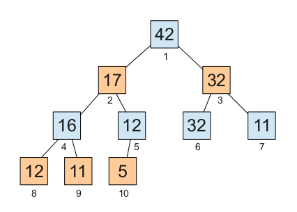
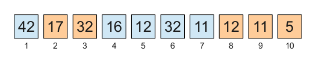
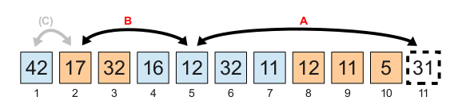
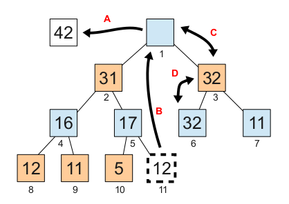
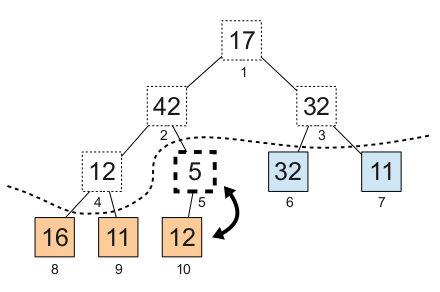

# Heap sort

## Main characteristics

The next table shows some important characteristics of this algorithm.

<table cellpadding='2' cellspacing='0' border='1'>
<tr>
<td>How long does it take?</td>
<td>
<table border='0'>
<tr><td>Worst case:</td><td><b>O(N log N)</b></td></tr>
<tr><td>Average case:</td><td><b>O(N log N)</b></td></tr>
<tr><td>Best case:</td><td><b>O(N log N)</b> with Floyd's optimization. Without Floyd's optimization it takes <b>O(N)</b> for the rare case of "equal data". For non-equal data (already sorted or not) it takes <b>O(N log N)</b>. See "<a href='ONBestCase.md'>About the claims of O(N) best case</a>"</td></tr>
</table>
</td>
</tr>
<tr><td>How much additional space does it require?</td><td><b>O(1)</b></td></tr>
<tr><td>Does it perform a <a href='StableSort.md'>stable sort</a>?</td><td><b>No</b></td></tr>
<tr><td>Is it a <a href='http://en.wikipedia.org/wiki/Sorting_network'>sorting network</a>?</td><td><b>No</b></td></tr>
</table>

NOTE: If you don't understand the **O(**_whatever_**)** stuff, see [The "Big O" notation](BigOhNotation.md).

You can find several implementations of this algorithm in [heapsort.c](../../src/heapsort.c).

## Description of the heap sort algorithm

This sorting algorithm works by organizing the data in a data structure called heap, and then extracting them from the heap in reverse order to let them laying sorted in the array.

Only **O(1)** additional space is required because the heap is built inside the array to be sorted.

This algorithm was proposed by J.W.J.Williams in 1964.

### What is a heap

A heap is a tree-shaped data structure (usually a binary tree) in which every node is greater or equal to its descendants:

It is usual to store this tree in an ordinary array:

If the elements are numbered starting with 1, like in the previous figures, then the children of the node number **n** happen to be at positions **2n** and **2n+1**. Similarly, the parent of node **n** is at position **n/2** (integer division).

### How to add elements to a heap

A new element can be added by creating a new node in the lowest level and, if necessary, making that value climb with swap operations.

The next figure shows the insertion of the value `31` in the previous heap:

We have to swap the `31` with the `12` (step A) and then with the `17` (step B) since `31` is greater than both. The last swap (step C) must not be done because `31` is less or equal to `42`.

This operation takes **O(N log N)** time, where **N** is the number of elements in the heap.

We could use this operation to organize the data of the array as a heap, but this is usually done in a more efficient way that I describe below.

### How to extract the maximum value from the heap

The maximum value is always at the top of the heap (the root of the tree), which is at the beginning of the array.

In order to extract an element from a heap, we have to move it to a temporary variable, move the last element of the heap to the hole, and then make it go up or down with swaps until the requirements of the heap are restored (every node must be greater or equal to its descendants).

While moving a value down, we always have to choose the greater of the children, because this child will become the parent of the other child.

In first place we save the maximum value (`42`) in a temporary variable (step A). Then the `12` occupies the hole (step B). Finally, we must swap the `12` with the `32` (step C), and then with the other `32` (step D).

This operation takes also **O(log N)**, where **N** is the number of elements in the heap.

When this operation is used in heap sort, the extracted value is stored in the hole left by the shrinking heap. That is, steps A and B are fused together in a swap operation. Thus the extracted value is left laying in its final position.

### How to build the heap quite faster

We can build a heap in far less time if we start with the lowest level, and then advance upwards level by level, processing the top only at the end.

In first place, we leave the leaf nodes as they are in the array. As long as their parents are not considered, the leaf nodes themselves do not violate any requirement.

Next we add the other nodes in reverse order, taking into account only the lower part of the heap:

In order to add the element at position 5 (casually with value `5`) we just need to swap it with its only descendant, which is greater (value `12`).

Then we would add the `12` that is at position 4. We would need to swap this `12` with the `16`, which is the greater of its children.

In a heap of **N** elements there are about **N/2** leaf nodes. Right above them there are about **N/4** nodes, and these require at most one swap each. Above them, in turn, we have about **N/8** nodes, and these require at most two swaps each, and so on. The total is about **N** swaps at most.

The time required for building the heap is, therefore, **O(N)**. This is a great improvement with respect to the **O(N log N)** time that we would need to build it from top to bottom.

This method for building the heap was proposed by Robert W.Floyd in 1964.

## Optimization of the chained swaps

The [chained swaps optimization](ChainedSwapsOptimization.md), also known as the _floating hole_, is usual in several sorting algorithms. The two implementations included in this project (in [heapsort.c](../../src/heapsort.c)) use this optimization instead of making simple swaps.

## Floyd's optimization

The operation of extracting the maximum from the heap is repeated **N-1** times in the second phase of heap sort. As I explained above, this operation requires to take an element from the end of the heap in order to put it in the top and let it fall to the corresponding new position. Since this substitute value comes from the base of the heap, chances are that it is a very low value, which will make it go down to the base of the heap in most cases.

Robert W. Floyd observed this fact and proposed a surprisingly useful optimization for heap sort. The optimization consists in moving the substitute down to the base unconditionally, and then move it up only if necessary. This way we save comparisons in the way down.

The function `heapsort_floyd()` (in [heapsort.c](../../src/heapsort.c)) uses this optimization.

The only drawback of this optimization is that it makes heap sort take always **O(N log N)**, even in the rare case of equal data. In this strange case, without Floyd's optimization, heap sort takes only **O(N)** time.

## Behaviour with nearly sorted data

### Equal data

In the rare case of all-equal data, heap sort takes **O(N)** time unless Floyd's optimization is used. In addition, the transition between **O(N)** and **O(N log N)** is smooth. If _nearly_ all data are equal, then it takes _nearly_ **O(N)** time.

If Floyd's optimization is used, then heap sort takes **O(N log N)** time in every case.

### Distinct data

If the data are distinct, heap sort takes **O(N log N)** time. Having them already sorted, unsorted or in reverse order does not make any difference.

The reason is that the heap is incompatible with sorted data. Even if the data are already sorted, the heap building inverts this order to some degree. The maximum value, for instance, is moved to the initial position of the array. Thus, once the heap has been built, the extraction of the data in order takes necessarily **O(N log N)** time.

The only way to make a similar algorithm take **O(N)** time with sorted data (and _nearly_ **O(N)** with _nearly_ sorted data) would be to design a heap in which the children took lower positions than the parent in the array. This would require the heap to grow by the top instead of growing by the base. This is the key to smooth sort.

  
 
**Author:** [Martín Knoblauch Revuelta](http://www.mkrevuelta.com/en/about-me/) 
This work is licensed under a [Creative Commons Attribution 3.0 Unported License](../LICENSE)</a>

