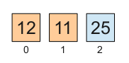

# Smooth sort

<p align="right"><i>Esta página está en inglés. Si usted lo prefiere, puede leer la <a href="../es/SmoothSort.md">versión española</a></i></p>

## Main characteristics

The next table shows some important characteristics of this algorithm.

<table cellpadding='2' cellspacing='0' border='1'>
<tr>
<td>How long does it take?</td>
<td>
<table border='0'>
<tr><td>Worst case:</td><td><b>O(N log N)</b></td></tr>
<tr><td>Average case:</td><td><b>O(N log N)</b></td></tr>
<tr><td>Best case:</td><td><b>O(N)</b> (<a href='ONBestCase.md'>Really!</a>)</td></tr>
</table>
</td>
</tr>
<tr><td>How much additional space does it require?</td><td><b>O(1)</b></td></tr>
<tr><td>Does it perform a <a href='StableSort.md'>stable sort</a>?</td><td><b>No</b></td></tr>
<tr><td>Is it a <a href='http://en.wikipedia.org/wiki/Sorting_network'>sorting network</a>?</td><td><b>No</b></td></tr>
</table>

NOTE: If you don't understand the **O(**_whatever_**)** stuff, see [The "Big O" notation](BigOhNotation.md).

You can find the implementation of this algorithm in [smoothsort.c](../../src/smoothsort.c). In addition, this project contains two variants of this algorithm. You can find them in [smoothsort\_fib\_1.c](../../src/smoothsort_fib_1.c) and [smoothsort\_pow2\_1.c](../../src/smoothsort_pow2_1.c).

## Description of the smooth sort algorithm

Smooth sort is an enhanced version of [heap sort](HeapSort.md). The advantage is that smooth sort takes **O(N)** time with already sorted data and, when the degree of disorder grows, the transition from **O(N)** to **O(N log N)** is smooth (hence the name). That is, smooth sort takes _nearly_ **O(N)** when the data are _nearly_ sorted.

This algorithm was proposed by [Edsger W. Dijkstra](http://es.wikipedia.org/wiki/Edsger_Dijkstra) in his EWD796: "Smoothsort, an alternative for sorting in situ" in 1981. One month later he distributed his EWD796a, a revised version of the former.

The web page ["Smoothsort Demystified"](http://www.keithschwarz.com/smoothsort/), by Keith Schwarz, describes this algorithm fabulously. I myself (Martín Knoblauch Revuelta, author of these lines) got to understand smooth sort thanks to this description.

### The problem of heap sort

If you are not familiarized with [heap sort](HeapSort.md), study it before proceeding with smooth sort.

### First great idea

The problem of [heap sort](HeapSort.md) stems precisely in the way it arranges the heap inside the array. Since the top sits in one end, and the heap grows level by level, it can only grow and shrink by the base. But the data are extracted from the top, which is in the opposite end of where they have to be laid in the array as the heap shrinks by the base, leaving free space. Therefore, once the heap has been built the data are sorted, to some extent, in the reverse of the desired order. Thus the second stage of the algorithm takes necessary **O(N log N)** time. Heap sort can not take benefit from the fact that the data are already sorted, because it needs to mess them up first, and sort them afterwards.

The first great idea is, obviously, to reverse the precedence relationship in the array. Instead of storing the parent in a low position, and its children in a higher position, we will do exactly the opposite:



Seen as a tree:


### Second great idea

The problem now is how to organize larger heaps, with sizes that usually do not fit a complete tree.

We might try a layout symmetric to the one used in heap sort. It would be the same, but the other way around. The top of the heap would sit at the end of the array, holding the maximum value, which would then be in its final position. The problems would start after extracting a few elements. Once extracted the top, there would be two heaps. After extracting their tops, there would be four, and so on. We would need to extract the tops of each level in a specific order, leaving free space to put the extracted maximum at every step. We would need to move data from some heaps to others, which is a serious problem because there would get to be many isolated mini-heaps. Near the end, when we approached the base, we would have a number of heaps proportional to **N** and we would have to find the maximum a number of times also proportional to **N** (the exact proportions depend on the distance to the base). The time complexity would be **O(N**<sup>2</sup>**)**.

We can afford to divide a heap in several smaller heaps, but we need to organize the data in a way that keeps the number of heaps relatively low. Since we have to access them **O(N)** times, there can not be more than **O(log N)** heaps.

The second great idea is to pack together the data of every sub-heap instead of arranging the elements by levels.


Note that the elements of the lowest level are not together in the corresponding array:


If we have two heaps of equal size sitting together, the next element that we add will become the top of a greater heap containing both of them. Later, when we extract the top element of the big heap, it will get divided into two smaller heaps.

This way, if we systematically fuse contiguous heaps with equal (or similar) sizes into larger heaps, we will never have more than **O(log N)** heaps.

### Third great idea

With the previous ideas we could already implement an algorithm that took **O(N log N)** time in the worst case:

   + Build a series of **O(log N)** heaps, fusing them systematically as described above
   + For each of the **N** elements of the array, in reverse order:
      - Search for the maximum value amongst the **O(log N)** heap tops
      - If the maximum is at a heap that is not the last one, swap it with the top of the last heap and repair the other heap (**O(log N)** time)
      - Extract the top of the last heap, creating two smaller heaps (**O(1)** time)

But this algorithm would also take **O(N log N)** time in the case of already sorted data.

The third great idea is to force an ascending order in the tops of the different heaps. This way, the top of the last heap will always contain the maximum value. We will not need to search for it. When we extract the top of the last heap we will create two smaller heaps but, if the data are already sorted, their tops already meet the constraint of being sorted with respect to the other heap tops.

With this change the extraction stage goes as follows:

   + For each of the **N** elements of the array, in reverse order:
      - Extract the top of the last heap, creating two smaller heaps (**O(1)** time)
      - Only if the tops of these two heaps are not sorted with respect to the other heap tops, sort them and repair the heaps where they end (**O(log N)** time if they are not sorted, but **O(1)** time if they are)

### Leonardo numbers

In the previous sections I tried to expose in a logical way the possible evolution from heap sort to smooth sort, but I took a small detour. I mentioned that the heaps must be fused systematically, as soon as possible, and I have shown how to fuse heaps of equal size. Though, Dijkstra did not propose to use equal sizes but consecutive sizes taken from a list of possible sizes.

In first place, to make the first heap, Dijkstra chose to wait until he had three elements. That is, a heap with one parent and two children. When there are only two elements, they form two trivial heaps of just one element each. This seems to contradict the previous rule, but Dijstra settled it by starting the list of possible sizes with { 1, 1 }. The sizes of these two heaps correspond to different elements of the list of possible sizes.

After this, every possible size is the sum of the two previous plus one (the two sub-heaps of consecutive sizes in the list plus the new top): { 1, 1, 3, 5, 9, 15, 25, 41, 67, 109... }. These are the so called [Leonardo numbers](http://en.wikipedia.org/wiki/Leonardo_numbers) (OEIS series [A001595](http://oeis.org/A001595)). Formally: L<sub>0</sub>=L<sub>1</sub>=1, L<sub>n</sub>=L<sub>n-1</sub>+L<sub>n-2</sub>+1 for every n>1.

In second place, the left sub-heap is always the larger of the two. The fusion with the right heap is always done before the right heap reaches the size of the left heap.

Therefore, the possible heaps have the next shapes:


Dijkstra mentioned in the same EWD796 that he might have used a different list of possible sizes:

> "One can also raise the question why I have chosen Leonardo
> numbers for my stretch lengths: ... 63 31 15 7 3 1 is also a
> possibility, which seems attractive since each stretch can now
> be viewed as the postorder traversal of a completely balanced
> tree. I know why I chose the Leonardo numbers: with the balanced
> binary trees the average number of stretches is 1.2559
> ( = (1/4) · (5+sqrt(5)) · (log2(1+sqrt(5))-1) times the average
> number of stretches with the Leonardo numbers. (I do not present
> this ratio as a compelling argument.)"

Had he chosen this series of possible sizes, he would have obtained an algorithm like the one implemented in [smoothsort\_pow2\_1.c](../../src/smoothsort_pow2_1.c).

By contrast, had he built the small heaps with just two elements (one parent and one child) he would have obtained an algorithm like the one implemented in [smoothsort\_fib\_1.c](../../src/smoothsort_fib_1.c). Regarding this possibility, Dijkstra made the next remark in his EWD796a:

> "Remark 2. We can now partly justify our choice of the Leonardo
> numbers as available stretch lengths, i.e. justify why we have
> not chosen (with the same recurrence relation)
> 
> ....   33   20   12   7   4   2   1   (0)   .
> 
> The occurrence of length 2 would have required a sift able
> to deal with fathers having one or two sons, like the sift
> required in heapsort ; thanks to the Leonardo numbers a father
> has always two sons and, consequently, smoothsort's sift is
> simpler. (End of Remark 2.)"

The number of heaps is **O(log N)** in the three implementations, but with different constant factors. We want to keep the number of heaps as low as possible, of course, but it is also good that the heaps have the minimum number of levels. In this aspect, the version that packs more elements in less levels is the version that uses powers of two, minus one (1, 3, 7, 15, 31, 63...).

In the following, I will continue describing the original version of the algorithm. The small differences that characterize the other versions are commented in the source files themselves.

## Implementation details of the algorithm

### How to compute the size of every heap

The implementation included in this project, like that of Keith Schwartz, uses a lookup table containing the Leonardo numbers. This is certainly the easiest option.

Dijstra's EWD796 proposed a more elegant method, but slightly cumbersome. The trick is to use two variables to hold the current heap size. The variable `b` contains the Leonardo number being managed. The variable `c` contains the preceding Leonardo number. For obvious practical reasons it is considered that L<sub>-1</sub>=-1.

To advance to the next number of Leonardo simply do:

```
    tmp = b;
    b = b + c + 1;
    c = tmp;
```

And to go back to the previous Leonardo number:

```
    tmp = c;
    c = b - c - 1;
    b = tmp;
```

Both operations take **O(1)** time. Any implementation that uses them must do so carefully to not raise the complexity of the algorithm above **O(N log N)**. To calculate Leonardo numbers starting with L<sub>0</sub> every time would be a blunder. We should always start from the current Leonardo number.

### How to locate the children of a node

Given the position (**x**) of an element of the array, supposing that it is part of a heap, how can we locate its child nodes?

The right child is trivial: it is the previous element in the array.

The left child is a bit more difficult. It is in the position previous to the right sub-heap. Therefore we need to know the size of the right sub-heap.

If the heap (or sub-heap) rooted at **x** has size **L<sub>n</sub>**:

   + The right sub-heap has size **L<sub>n-2</sub>** and its root is in **x-1**
   + The left sub-heap has size **L<sub>n-1</sub>** and its root is in **x-1-L<sub>n-2</sub>**

Obviously, to move through a (sub-)heap we need to know not only the position of its root, but also its size.

### How to keep track of the heaps of the list

In first place we have to think about how many heaps will there be and what will be their size. In second place we need to think about how will we move through the list of heaps.

We fuse the heaps whenever it is possible. As soon as we have two heaps together with consecutive sizes (I mean consecutive Leonardo numbers), while adding one more element we convert these two heaps in one even larger heap. If this new heap happens to be of a size consecutive to an older, neighbour heap, we will fuse them while adding the next element, and so on.

Only when we can not fuse heaps, we create a heap of size L<sub>1</sub>. If this one can not be fused with the previous, then we create a heap of size L<sub>0</sub>.

The rightmost heap can never reach the size of its left neighbour, because we fuse them together before this happens. The heap resulting from this fusion can not have the same size as an older heap because this would mean that, at some point in the past, there were two neighbour heaps with contiguous sizes and we did not fuse them.

As a result:

   1. There will never be two heaps with the same size
   2. Every heap is always smaller than those at its left
   3. If there are two heaps of consecutive sizes they can only be at the end of the list

Supposing that the maximum number of elements is 2<sup>32</sup>, the list of possible sizes goes from L<sub>0</sub> to L<sub>46</sub>. Since there can not be two heaps of the same size, we only need one bit per possible size.

As for how we move through the list of heaps, we will slowly add heaps at the end of the list. Occasionally we will need to move through the list to the left, either merging heaps or exchanging values ​​to ensure that the tops are ordered from lowest to highest.

Therefore we will keep the list in an unsigned integer of 64 bits (`uint64_t` in C).

The most frenetic activity will always be focused on the end of the list, merging or dividing the smaller heaps. Therefore we will keep the bit mask shifted to the right so that the last bit is always a 1. Another variable called `offset` will indicate how many zeros would follow the 1 in the mask if it was not shifted. The value L<sub><code>offset</code></sub> will be precisely the size of the heap we are working on.

To move left through the list of heaps, we will make a copy of the mask, the offset and the current position in the array. We will subtract the number of elements of the current heap (L<sub><code>offset</code></sub>) from the current position in the array, thus moving to the previous heap. Then we will shift to the right the copy of the mask until the next 1 occupies the lowest bit position, incrementing the copy of `offset` as it corresponds.

The two last heaps can (and must) be fused if their sizes are contiguous Leonardo numbers. To check this condition we can simply make a bitwise _and_ operation of the mask with the value 2 (`mask & 2` in C). Bit 0 is always 1. Therefore, if bit 1 is also 1, we have fusible heaps. Dijkstra proposed to perform this check with "<u>if</u> p <u>mod</u> 8 = 3".


### How to maintain the tops of the heaps in ascending order

During the first stage of the algorithm, every time we add an element fusing two existing heaps, this new heap becomes the top of a new heap.

Sometimes it will suffice to make a _sift_ operation. But other times we will need to do something to verify and, if necessary, restore the ascending order of the tops of the heaps.

It may well be that we need to exchange the new top element with the top of the heap at the left. We may even need to repeat this process with the next heap at the left and so on until we have dragged the new item to the top of the first heap of the list.

We can take for granted that the tops of the heaps at the left are already in ascending order, so we just need to insert the value of the new top in this sorted list. After this we will do a _sift_ in the heap where the inserted value has ended.

In total we will make just one _sift_ per insertion. The trick is that we will drag the new element in the insertion, but we will not compare directly this value with the tops of the other heaps. Instead, we will compare the maximum of:

   + The element that we are dragging
   + The top of the left sub-heap of the current heap
   + The top of the right sub-heap of the current heap

Thus, if the new element has a small value, but the current heap contains some value greater or equal to the top of the heap at the left, we will stop the insertion and make a _sift_, and then the tops will be in ascending order.

Dijstra called this operation "_trinkle_".

In the second stage of the sorting, while extracting elements from the list of heaps, we will make a very similar operation. When we deprive a heap of its top, exposing its two sub-heaps, we will need to do a "_semitrinkle_" with each of these sub-heaps. First with the left one, and then with the right one.

The only difference with respect to _trinkle_ is that _semitrinkle_ can compare directly the top of the initial heap, since it is guaranteed that this top contains the maximum value of the heap. Though, after this first step, it has to operate exactly like _trinkle_.

In the implementations included in this project I preferred to call _trinkle_ `interheap_sift()`, which I find a bit more explanatory. Instead of programming a _semitrinkle_, I directly used _trinkle_ (`interheap_sift()`) in every case.

### Heaps that will be fused and heaps that will not

In the first stage of the sorting, while building the list of heaps, we will not need to do _trinkle_ in every occasion. We will just need to do it when we finish building a final heap, that is, one that will not be fused with any other heap.

In order to find out whether a heap will be fused or not we need to consider two possibilities:

   1. It can be fused with the one at its left. This simply requires that the left heap has the correct size and that there is one more element in the array.
   2. It can be fused with a new heap that would grow at its right. This requires space in the array for this new heap and one more element.

If the heap is going to be fused, doing a _sift_ is enough. Otherwise, if it is a final heap, we will need to do a _trinkle_.

## Optimization of the chained swaps

The [chained swaps optimization](ChainedSwapsOptimization.md), also known as the _floating hole_, is usual in several sorting algorithms. The three implementations included in this project (in [smoothsort.c](../../src/smoothsort.c), [smoothsort\_fib\_1.c](../../src/smoothsort_fib_1.c) and [smoothsort\_pow2\_1.c](../../src/smoothsort_pow2_1.c)) use this optimization instead of making simple swaps.

## Behaviour with nearly sorted data

When the input data are already sorted this algorithm takes **O(N)** time. When the data are _nearly_ sorted it takes _nearly_ **O(N)** time. The transition to **O(N log N)** is smooth.

<br><br>
<a href='../LICENSE'></a><br>
**Author:** [Martín Knoblauch Revuelta](http://www.mkrevuelta.com/en/about-me/)<br>
This work is licensed under a [Creative Commons Attribution 3.0 Unported License](../LICENSE)</a>

