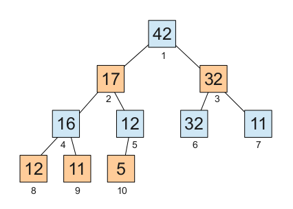
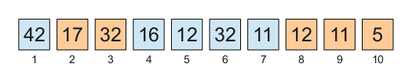
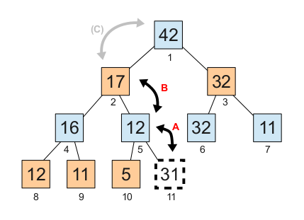
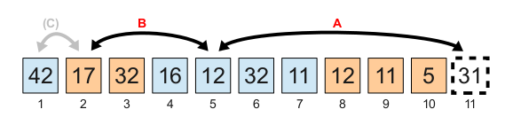
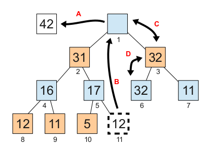
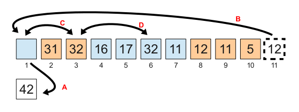
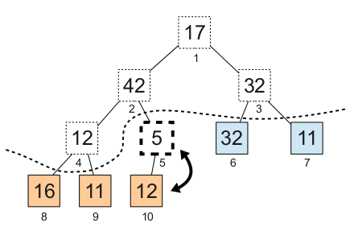
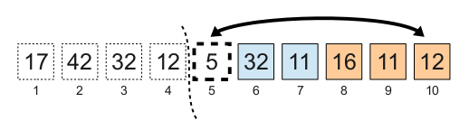

# Ordenación por montículo (heap sort)

<i>This page is in Spanish. If you prefer, you can read the <a href="../en/HeapSort.md">English version</a></i>

## Características principales

La siguiente tabla muestra algunas características importantes de este algoritmo.

<table cellspacing=0 cellpadding=2 border=1>
<tr>
<td>¿Cuánto tarda?</td>
<td>
<table border=0>
<tr><td>Peor caso:</td><td><b>O(N log N)</b></td></tr>
<tr><td>Caso medio:</td><td><b>O(N log N)</b></td></tr>
<tr><td>Mejor caso:</td><td><b>O(N log N)</b> con la optimización de Floyd. Sin la optimización de Floyd tarda <b>O(N)</b> en el extraño caso de "datos iguales". Con datos distintos (ya ordenados o sin ordenar) tarda <b>O(N log N)</b>. Vea "<a href='ONBestCase.md'>Acerca de las alegaciones de tiempos O(N) en el mejor caso</a>"</td></tr>
</table>
</td>
</tr>
<tr><td>¿Cuánto espacio adicional necesita?</td><td><b>O(1)</b></td></tr>
<tr><td>¿Realiza una [ordenación estable](StableSort.md)?</td><td><b>No</b></td></tr>
<tr><td>¿Es una [red de ordenación](http://en.wikipedia.org/wiki/Sorting_network)?</td><td><b>No</b></td></tr>
</table>

NOTA: Si no entiende los *O(*_lo que sea_*)* vea [La notación de la "O grande"](BigOhNotation.md).

Puede encontrar varias implementaciones de este algoritmo en [heapsort.c](../../src/heapsort.c).

## Descripción del algoritmo de ordenación por montículo (heap sort)

El algoritmo de ordenación por montículo opera organizando los datos en una estructura de datos llamada montículo (_heap_) para después extraerlos en orden inverso (de mayor a menor) e irlos dejando en orden dentro del mismo array.

Sólo se usa **O(1)** espacio adicional porque el montículo se construye dentro del propio array a ordenar.

Este algoritmo fue propuesto por J. W. J. Williams en 1964.

### Qué es un montículo (heap)

Un montículo es una estructura de datos en forma de árbol (generalmente binario) en el que cada nodo es mayor o igual que sus descendientes:

Lo habitual es almacenar ese árbol en un simple array:

Si se numeran los elementos empezando con 1, como en las figuras anteriores, se cumple que los hijos del nodo número **n** se encuentran en las posiciones **2n** y **2n+1**. De forma similar, el padre del nodo **n** se encuentra en la posición **n/2** (división entera).

### Cómo añadir elementos a un montículo

Se puede añadir un elemento creando un nuevo nodo en el nivel más bajo y, si es necesario, haciendo trepar el valor mediante intercambios.

A continuación se muestra la inserción del valor `31` en el montículo anterior: 

Hay que intercambiar el `31` con el `12` (paso A) y después con el `17` (paso B) porque `31` es mayor que ambos. El último intercambio (paso C) no se realiza porque `31` es menor o igual que `42`.

Esta operación requiere un tiempo **O(log N)**, donde **N** es el número de elementos del montículo.

Se puede usar esta operación para organizar los datos del array en forma de montículo, pero lo habitual es construir el montículo de una forma más eficiente que comentaré más adelante.

### Cómo extraer el valor máximo de un montículo

El valor máximo siempre se encuentra en la cima del montículo (la raíz del árbol), que está al principio del array.

Para extraer un elemento de un montículo hay que moverlo a una variable temporal, mover el último elemento del montículo al hueco, y hacerlo subir o bajar mediante intercambios hasta restablecer las condiciones del montículo (cada nodo debe ser mayor o igual que sus descendientes).

Al mover un valor hacia abajo hay que elegir siempre el mayor de los hijos, porque ese pasará a ser padre del otro hijo.

En primer lugar salvamos el valor máximo (`42`) en una variable temporal (paso A). A continuación el `12` pasa a ocupar el hueco (paso B). Finalmente debemos intercambiar el `12` con el `32` (paso C), y después con el otro `32` (paso D).

Esta operación también tarda **O(log N)**, donde **N** es el número de elementos del montículo.

Cuando se utiliza esta operación en el algoritmo de ordenación por montículo, se guarda el valor extraído en el hueco que queda al reducir el tamaño del montículo. Es decir, se fusionan los pasos A y B en un intercambio. Así el valor extraído del montículo queda en su posición definitiva.

### Cómo construir el montículo mucho más rápido

Se puede construir un montículo en menos tiempo si se empieza por el nivel más bajo y se avanza hacia arriba nivel a nivel, dejando la cima para el final.

En primer lugar, se dejan los nodos hoja como estén en el array. Mientras no se considere a sus padres, los nodos hoja no violan ninguna regla por sí mismos.

A continuación se incorporan los demás nodos en orden inverso, teniendo en cuenta sólo la parte inferior del montículo:

Para incorporar el elemento de la posición 5 (casualmente con valor `5`) basta intercambiarlo con su único descendiente, que es mayor (valor `12`).

Lo siguiente sería incorporar el `12` que hay en la posición 4. Habría que intercambiar ese `12` con el `16`, que es el mayor de sus hijos.

En un montículo de **N** elementos hay unos **N/2** nodos hoja. Justo encima de esos nodos hoja hay unos **N/4** nodos, y éstos requieren como máximo un intercambio cada uno. Los que hay encima de éstos últimos son unos **N/8** y requieren como máximo dos intercambios cada uno, y así sucesivamente. En total son unos **N** intercambios como máximo.

El tiempo necesario para construir el montículo es, por lo tanto, **O(N)**. Esto supone una ventaja considerable frente al tiempo **O(N log N)** que costaría construirlo de arriba hacia abajo.

Este método para la construcción del montículo fue propuesto por Robert W. Floyd en 1964.

## Optimización de los intercambios encadenados

La [optimización de los intercambios encadenados](ChainedSwapsOptimization.md), también conocida como el _hueco flotante_, es habitual en varios algoritmos de ordenación. Las dos implementaciones incluidas en este proyecto (en [heapsort.c](../../src/heapsort.c)) usan esta optimización en lugar de hacer simples intercambios.

## Optimización de Floyd

En la segunda fase de la ordenación se repite **N-1** veces la operación de extraer el valor máximo del montículo. Como he explicado anteriormente, esa operación requiere tomar un elemento del final del montículo para ponerlo en la cima y dejarlo caer hasta donde corresponda. Puesto que ese valor sustituto proviene de la base del montículo, es muy probable que sea un valor pequeño, lo que hará que baje hasta la base del montículo en la mayor parte de los casos.

Robert W. Floyd observó este hecho y propuso una optimización sorprendentemente útil para este algoritmo. La optimización consiste en bajar el sustituto incondicionalmente hasta la base del montículo, para volver a subirlo después si es necesario. De esta forma se ahorran comparaciones en la bajada.

La función `heapsort_floyd()` (en [heapsort.c](../../src/heapsort.c)) utiliza esta optimización.

El único inconveniente de esta optimización es que hace que el algoritmo tarde siempre **O(N log N)**, incluyendo el extraño caso de que los datos a ordenar sean todos iguales. En este extraño caso, sin la optimización de Floyd, el algoritmo tarda sólo **O(N)**.

## Comportamiento con datos casi ordenados

### Datos iguales

En el extraño caso de que todos los datos sean iguales, este algoritmo tarda **O(N)**, a menos que se utilice la optimización de Floyd. Además, la transición entre **O(N)** y **O(N log N)** es suave. Si _casi_ todos los datos son iguales entre sí, se tarda _casi_ **O(N)**.

Si se utiliza la optimización de Floyd, el algoritmo tarda **O(N log N)** en todos los casos.

### Datos distintos

Si los datos son distintos entre sí, la ordenación tarda **O(N log N)**. No importa si están ordenados, desordenados, o en orden inverso.

La razón es que el montículo es incompatible con los datos ordenados. Aunque los datos de entrada estén ordenados, la construcción del montículo invierte ese orden en cierta medida. El valor máximo queda en la posición inicial, por ejemplo. Por eso, una vez que se ha construido el montículo, la extracción de los datos en orden tarda necesariamente **O(N log N)**.

La única manera de hacer que un algoritmo semejante tardase **O(N)** con datos ordenados (y _casi_ **O(N)** con datos _casi_ ordenados) sería diseñar un montículo en el que los hijos estuvieran en posiciones del array más bajas que la del padre. Esto requeriría que el montículo creciese por la cima en vez de crecer por la base. Esa es la clave del funcionamiento del algoritmo de [ordenación suave (smooth sort)](SmoothSort.md).

  
 
**Autor:** [Martín Knoblauch Revuelta](http://www.mkrevuelta.com/es/acerca-de-mi/) 
El contenido de esta página está bajo una [licencia de Creative Commons Reconocimiento 3.0 Unported](../LICENSE)</a>

