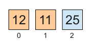
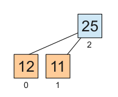
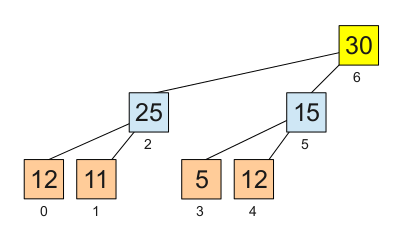
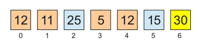
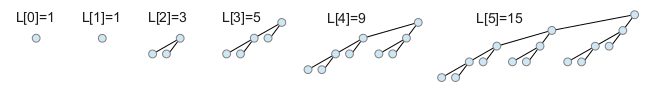
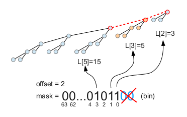

# Ordenación suave (smooth sort)

<p align="right"><i>This page is in Spanish. If you prefer, you can read the <a href="../en/SmoothSort.md">English version</a></i></p>

## Características principales

La siguiente tabla muestra algunas características importantes de este algoritmo.

<table cellspacing=0 cellpadding=2 border=1>
<tr>
<td>¿Cuánto tarda?</td>
<td>
<table border=0>
<tr><td>Peor caso:</td><td><b>O(N log N)</b></td></tr>
<tr><td>Caso medio:</td><td><b>O(N log N)</b></td></tr>
<tr><td>Mejor caso:</td><td><b>O(N)</b> (<a href='ONBestCase.md'>¡De verdad!</a>)</td></tr>
</table>
</td>
</tr>
<tr><td>¿Cuánto espacio adicional necesita?</td><td><b>O(1)</b></td></tr>
<tr><td>¿Realiza una [ordenación estable](StableSort.md)?</td><td><b>No</b></td></tr>
<tr><td>¿Es una [red de ordenación](http://en.wikipedia.org/wiki/Sorting_network)?</td><td><b>No</b></td></tr>
</table>

NOTA: Si no entiende los *O(*_lo que sea_*)* vea [La notación de la "O grande"](BigOhNotation.md).

Puede encontrar la implementación de este algoritmo en [smoothsort.c](../../src/smoothsort.c). Este proyecto contiene además dos variantes de este algoritmo. Puede encontrar sus implementaciones en [smoothsort\_fib\_1.c](../../src/smoothsort_fib_1.c) y [smoothsort\_pow2\_1.c](../../src/smoothsort_pow2_1.c).

## Descripción del algoritmo de ordenación suave (smooth sort)

El algoritmo de ordenación suave (_smooth sort_) es una versión mejorada del algoritmo de [ordenación por montículo (heap sort)](HeapSort.md). La ventaja es que _smooth sort_ tarda **O(N)** con datos ya ordenados y, cuando el grado de desorden aumenta, la transición de **O(N)** a **O(N log N)** es suave (de ahí el nombre: "_smooth_"). Es decir, que _smooth sort_ tarda _casi_ **O(N)** cuando los datos están _casi_ ordenados.

Este algoritmo fue propuesto por [Edsger W. Dijkstra](http://es.wikipedia.org/wiki/Edsger_Dijkstra) en su EWD796: "Smoothsort, an alternative for sorting in situ" en 1981. Un mes más tarde distribuyó su EWD796a, una versión revisada del anterior.

La página web ["Smoothsort Demystified"](http://www.keithschwarz.com/smoothsort/), de Keith Schwarz, describe magníficamente este algoritmo. Yo mismo (Martín Knoblauch Revuelta, el autor de estas líneas) conseguí entender el algoritmo gracias a esa descripción.

### El problema de la ordenación por montículo (heap sort)

Si no está familiarizado con el algoritmo de [ordenación por montículo (heap sort)](HeapSort.md), estúdielo antes de continuar.

### Primera gran idea

El problema de [heap sort](HeapSort.md) tiene su raíz precisamente en la forma en que organiza el montículo dentro del array. Como la cima queda en un extremo, y el montículo crece nivel a nivel, sólo puede crecer o encoger por la base. Pero los datos se extraen por la cima, que está en el extremo opuesto a donde se van dejando en el array al encoger el montículo por la base. Por lo tanto, una vez construido el montículo los datos quedan ordenados, en cierta medida, en orden inverso al deseado. Por eso la segunda etapa del algoritmo tarda necesariamente **O(N log N)**. El algoritmo de ordenación por montículo no puede aprovechar el hecho de que los datos están casi ordenados, porque necesita desordenarlos para después ordenarlos de nuevo.

La primera gran idea es, obviamente, dar la vuelta a la relación de precedencia en el array. En vez de almacenar al padre en una posición baja y a sus hijos en una posición más alta, haremos todo lo contrario:



Visto en forma de árbol:



### Segunda gran idea

Ahora el problema es cómo organizar montículos más grandes, con tamaños que no tienen por qué coincidir con el de un árbol completo.

Podríamos pensar en una organización simétrica a la empleada en [_heap sort_](HeapSort.md). Sería igual, pero al revés. La cima del montículo quedaría al final del array, conteniendo el valor máximo, que ya estaría en su posición definitiva. Las dificultades empezarían al extraer los elementos. Una vez extraída la cima, quedarían dos montículos. Tras extraer sus cimas quedarían cuatro, y así sucesivamente. Tendríamos que extraer las cimas de cada nivel en orden para ir dejando los huecos en los que depositar el valor máximo a cada paso. Necesitaríamos mover datos de unos montículos a otros, lo cual es un problema serio porque llegaría a haber demasiados mini-montículos aislados entre sí. Al acercarnos a la base tendríamos un número de montículos proporcional a **N** y tendríamos que buscar el valor máximo entre ellos una cantidad de veces que también sería proporcional a **N** (las proporciones concretas dependen de la altura respecto a la base). La complejidad sería **O(N<sup>2</sup>)**.

Podemos permitirnos dividir un montículo en varios montículos menores, pero necesitamos organizar los datos de forma que el número total de montículos separados sea relativamente bajo. Como tenemos que acceder a ellos **O(N)** veces, debe haber como máximo **O(log N)** montículos.

La segunda gran idea es empaquetar juntos los datos de cada sub-montículo en vez de organizar los elementos por niveles.



Note que los elementos del nivel más bajo no están todos juntos en el array correspondiente:



Si tenemos dos montículos iguales uno al lado del otro, el siguiente elemento que añadamos pasará a ser la cima de un montículo mayor que los contenga a ambos. Más tarde, cuando extraigamos el elemento que está en la cima de un montículo, se dividirá en dos montículos menores.

De esta forma, si fusionamos sistemáticamente los montículos contiguos de tamaños iguales (o similares) en montículos más grandes, nunca tendremos más de **O(log N)** montículos.

### Tercera gran idea

Con lo descrito hasta ahora ya podríamos implementar un algoritmo que tardara **O(N log N)** en el peor caso:

   + Construir la serie de **O(log N)** montículos, fusionándolos de forma sistemática como se ha descrito anteriormente
   + Por cada uno de los **N** elementos del array, en orden inverso:
      - Buscar el valor máximo entre las **O(log N)** cimas de los montículos
      - Si el valor máximo está en la cima de un montículo que no es el último, intercambiarla con la cima del último y reparar el otro montículo (tiempo **O(log N)**)
      - Extraer la cima del último montículo, creando dos montículos menores (tiempo **O(1)**)

Pero este algoritmo tardaría también **O(N log N)** en el caso de que los datos estuvieran ordenados.

La tercera gran idea consiste en forzar un orden ascendente en las cimas de los distintos montículos. Así, la cima del último montículo contendrá siempre el valor máximo. No será necesario buscarlo. Al extraer la última cima se crearán dos montículos menores, pero si los datos están ya ordenados, sus cimas cumplirán ya la restricción de estar ordenadas respecto a las demás cimas.

Con este cambio la etapa de extracción queda como sigue:

   + Por cada uno de los **N** elementos del array, en orden inverso:
      - Extraer la cima del último montículo, creando dos montículos menores (tiempo **O(1)**)
      - Sólo si las cimas de estos montículos no están en orden respecto a las otras cimas, ordenarlas y reparar los montículos a los que hayan ido a parar (tiempo **O(log N)** si están desordenadas, pero **O(1)** si están ordenadas)

### Los números de Leonardo

En los apartados anteriores he tratado de exponer de forma lógica la posible evolución de [_heap sort_](HeapSort.md) hacia _smooth sort_, pero me he desviado ligeramente del camino. He mencionado que los montículos se deben fusionar sistemáticamente, tan pronto como sea posible, y he mostrado cómo fusionar montículos de tamaños iguales. Pero Dijkstra no propuso usar tamaños iguales sino tamaños consecutivos de una lista de posibles tamaños.

En primer lugar, Dijkstra eligió esperar a tener tres elementos para formar el primer montículo, que tendría un padre y dos hijos. Cuando sólo hay dos elementos, estos forman sendos montículos triviales de un único elemento cada uno. Esto parece contradecir a la regla anterior, pero Dijkstra lo solventó empezando la lista de tamaños posibles con { 1, 1 }. Los tamaños de esos dos montículos triviales corresponden a distintos elementos de la lista de tamaños posibles.

A partir de ahí cada tamaño posible es la suma de los dos anteriores más uno (los dos sub-montículos de tamaños consecutivos en la lista más la nueva cima): { 1, 1, 3, 5, 9, 15, 25, 41, 67, 109... }. Estos son los llamados [números de Leonardo](http://en.wikipedia.org/wiki/Leonardo_numbers) (serie OEIS [A001595](http://oeis.org/A001595)). Formalmente: L<sub>0</sub>=L<sub>1</sub>=1, L<sub>n</sub>=L<sub>n-1</sub>+L<sub>n-2</sub>+1 para todo n>1.

En segundo lugar, el sub-montículo izquierdo es siempre el más grande de los dos. La fusión con el montículo derecho se realiza antes de que éste último llegue a alcanzar el tamaño del izquierdo.

Con todo esto, los posibles montículos tienen el siguiente aspecto:



Dijkstra mencionó en el mismo EWD796 que podría haber utilizado otra lista de tamaños posibles:

> "One can also raise the question why I have chosen Leonardo
> numbers for my stretch lengths: ... 63 31 15 7 3 1 is also a
> possibility, which seems attractive since each stretch can now
> be viewed as the postorder traversal of a completely balanced
> tree. I know why I chose the Leonardo numbers: with the balanced
> binary trees the average number of stretches is 1.2559
> ( = (1/4) · (5+sqrt(5)) · (log2(1+sqrt(5))-1) times the average
> number of stretches with the Leonardo numbers. (I do not present
> this ratio as a compelling argument.)"

Si hubiera escogido esa serie de tamaños posibles habría obtenido un algoritmo como el implementado en [smoothsort\_pow2\_1.c](../../src/smoothsort_pow2_1.c).

Por otro lado, si hubiera construído los montículos pequeños con sólo dos elementos (un padre y un hijo) habría obtenido un algoritmo como el implementado en [smoothsort\_fib\_1.c](../../src/smoothsort_fib_1.c). Respecto a esta posibilidad, Dijkstra hizo el siguiente comentario en su EWD796a:

> "Remark 2. We can now partly justify our choice of the Leonardo
> numbers as available stretch lengths, i.e. justify why we have
> not chosen (with the same recurrence relation)
> 
>  ....   33   20   12   7   4   2   1   (0)   .
> 
> The occurrence of length 2 would have required a sift able
> to deal with fathers having one or two sons, like the sift
> required in heapsort ; thanks to the Leonardo numbers a father
> has always two sons and, consequently, smoothsort's sift is
> simpler. (End of Remark 2.)"

El número de montículos es **O(log N)** en las tres implementaciones, pero con diferentes factores constantes. Naturalmente, hay que mantener el número de montículos lo más bajo posible, pero también conviene que los montículos tengan el menor número posible de niveles. En este sentido, la versión que empaqueta más elementos en menos niveles es la de las potencias de dos, menos uno (1, 3, 7, 15, 31, 63...).

En lo sucesivo continuaré describiendo la versión original del algoritmo. Las pequeñas diferencias que caracterizan a las otras dos versiones están documentadas con comentarios en los propios archivos de código.

## Detalles de la implementación del algoritmo

### Cómo calcular el tamaño de cada montículo

La implementación incluida en este proyecto, a semejanza de la de Keith Schwartz, usa una tabla precalculada que contiene los números de Leonardo. Esta es, sin duda, la opción más sencilla.

El EWD796 de Dijkstra proponía un método algo más elegante, aunque ligeramente engorroso. El truco consiste en usar dos variables para mantener el tamaño del montículo actual. La variable `b` contiene el número de Leonardo que se está manejando. La variable `c` contiene el número de Leonardo inmediatamente anterior. Por motivos prácticos obvios se considera que L<sub>-1</sub>=-1.

Para avanzar hasta el siguiente número de Leonardo basta hacer:

```C
    tmp = b;
    b = b + c + 1;
    c = tmp;
```

Y para retroceder hasta el número de Leonardo anterior:

```C
    tmp = c;
    c = b - c - 1;
    b = tmp;
```

Ambas operaciones tardan **O(1)**. Cualquier implementación que las use deberá hacerlo cuidadosamente para no elevar la complejidad del algoritmo por encima de **O(N log N)**. Calcular los números de Leonardo empezando siempre por L<sub>0</sub> sería una torpeza. Hay que moverse siempre a partir del número de Leonardo actual.

### Cómo localizar los hijos de un nodo

Dada la posición (**x**) de un elemento en el array, suponiendo que forma parte de un montículo, ¿cómo podemos localizar sus nodos hijo?

El hijo derecho es trivial: es justo el elemento anterior en el array.

El hijo izquierdo es un poco más difícil. Está justo en la posición anterior al sub-montículo derecho. Por lo tanto necesitamos saber el tamaño del sub-montículo derecho.

Si el montículo o sub-montículo cuya raíz está en **x** tiene tamaño **L<sub>n</sub>**:

   + El sub-montículo derecho tiene tamaño **L<sub>n-2</sub>** y su raíz está en **x-1**
   + El sub-montículo izquierdo tiene tamaño **L<sub>n-1</sub>** y su raíz está en **x-1-L<sub>n-2</sub>**

Obviamente, para movernos por un (sub-)montículo necesitamos saber no sólo la posición de su raíz sino también su tamaño.

### Cómo mantener localizados los montículos de la lista

En primer lugar tenemos que reflexionar sobre cuántos montículos habrá y qué tamaños tendrán. En segundo lugar debemos pensar en cómo necesitaremos movernos por la lista de montículos.

Fusionamos los montículos siempre que es posible. En cuanto hay dos montículos juntos con tamaños consecutivos (quiero decir números de Leonardo consecutivos), al añadir un elemento más convertimos esos dos montículos en uno de tamaño aún mayor. Si ese nuevo montículo resulta ser de tamaño consecutivo a otro montículo vecino más viejo, los fusionaremos al añadir el siguiente elemento, y así sucesivamente.

Sólo cuando ya no podemos fusionar montículos, creamos un montículo de tamaño L<sub>1</sub>. Si ese tampoco se puede fusionar con el anterior, entonces creamos a continuación un montículo de tamaño L<sub>0</sub>.

El montículo de más a la derecha no puede nunca alcanzar el tamaño del que tiene justo a la izquierda porque los fusionamos antes de que eso ocurra. El montículo resultante de esa fusión no puede tener el mismo tamaño que otro más viejo porque eso significaría que en algún momento hubo dos montículos vecinos con tamaños consecutivos y no los fusionamos.

Como consecuencia:

   1. Nunca habrá dos montículos del mismo tamaño
   2. Cada montículo es siempre más pequeño que los que tiene a la izquierda
   3. Sólo puede haber montículos con tamaños consecutivos al final de la lista

Suponiendo que el número máximo de elementos es 2<sup>32</sup>, la lista de tamaños posibles va desde L<sub>0</sub> hasta L<sub>46</sub>. Como no puede haber dos montículos del mismo tamaño, nos basta un bit por cada tamaño posible. 

En cuanto a la forma en que nos moveremos por la lista de montículos, iremos añadiendo montículos al final de la lista. Ocasionalmente necesitaremos movernos por la lista hacia la izquierda, ya sea fusionando montículos o intercambiando valores para garantizar que las cimas están ordenadas de menor a mayor.

Por todo ello guardaremos la lista de montículos en un entero sin signo de 64 bits (`uint64_t` en C).

La actividad más frenética se centrará siempre al final de la lista, fusionando o dividiendo los montículos más pequeños. Por lo tanto mantendremos la máscara de bits desplazada hacia la derecha de forma que su último bit sea siempre un 1. Otra variable llamada `offset` (desplazamiento) indicará cuántos ceros seguirían a ese 1 en la máscara si no estuviera desplazada. El valor L<sub>`offset`</sub> será precisamente el tamaño del montículo con el que estamos trabajando.

Para movernos hacia la izquierda por la lista de montículos, haremos una copia de la máscara, del desplazamiento y de la posición actual en el array. A la posición actual le restaremos el número de elementos del montículo actual (L<sub>desplazamiento</sub>), situándonos así en el montículo anterior. Entonces desplazaremos la copia de la máscara hacia la derecha hasta que el siguiente 1 ocupe el bit más bajo, incrementando la copia de `offset` según corresponda.

Los dos últimos montículos se pueden (y deben) fusionar si sus tamaños son números de Leonardo consecutivos. Para comprobar esta condición bastará hacer una operación _and_ bit a bit de la máscara con el valor 2 (en C: `mask & 2`). El bit 0 siempre vale 1, así que si el bit 1 también vale 1, tenemos montículos fusionables. Dijkstra propuso realizar esta comprobación con "<u>if</u> p <u>mod</u> 8 = 3".



### Cómo mantener las cimas de los montículos en orden ascendente

En la primera etapa del algoritmo, cada vez que añadamos un elemento fusionando dos montículos existentes, ese nuevo elemento se convertirá en la raíz de un nuevo montículo.

En ciertas ocasiones bastará con hacer una operación _sift_. Pero en otras ocasiones necesitaremos hacer algo para verificar y, si hace falta, restablecer el orden ascendente de las cimas de los montículos.

Es muy posible que necesitemos intercambiar el elemento de la nueva cima con el de la cima del montículo que está a la izquierda. Puede incluso que necesitemos repetir esta operación con el siguiente montículo a la izquierda y seguir así hasta haber arrastrado el nuevo elemento a la cima del primer montículo de la lista.

Podemos suponer que las cimas de los montículos que hay a la izquierda están ordenadas entre sí, así que sólo tenemos que insertar la nueva cima en esa lista ordenada. Al final haremos un _sift_ en el montículo al que haya ido a parar el elemento insertado.

En total sólo haremos un _sift_ por cada inserción. El truco está en que arrastraremos el nuevo elemento en la inserción, pero no compararemos directamente ese valor con las cimas de los montículos. En su lugar, compararemos el máximo de:

   + El elemento que estamos arrastrando
   + La cima del sub-montículo izquierdo del montículo actual
   + La cima del sub-montículo derecho del montículo actual

Así, si el nuevo elemento tiene un valor pequeño, pero en el montículo actual hay algún valor mayor o igual que la cima de la izquierda, detendremos la inserción, haremos un _sift_ y las cimas quedarán ordenadas.

Dijkstra llamó a esta operación "_trinkle_".

En la segunda etapa de la ordenación, al extraer elementos de la lista de montículos, realizaremos una operación muy parecida. Cuando privemos a un montículo de su cima, exponiendo sus dos sub-montículos, tendremos que hacer un "_semitrinkle_" con cada uno de estos dos nuevos montículos. Primero con el de la izquierda, y después con el de la derecha.

La única diferencia respecto a _trinkle_ es que _semitrinkle_ puede comparar directamente la cima del montículo inicial, puesto que está garantizado que esa cima contiene el máximo del montículo. No obstante, tras ese primer paso, debe operar igual que _trinkle_. 

En las implementaciones incluidas en este proyecto he preferido llamar a _trinkle_ `interheap_sift()`, que me parece algo más explicativo. En vez de programar un _semitrinkle_, he usado directamente _trinkle_ (`interheap_sift()`) en todos los casos.

### Montículos que serán fusionados y montículos que no

En la primera etapa de la ordenación, al construir la lista de montículos, no necesitaremos hacer _trinkle_ en todas las ocasiones. Sólo deberemos hacerlo al terminar de construir un montículo definitivo, es decir, uno que ya no se fusionará con ningún otro.

Para saber si un montículo se fusionará debemos contemplar dos posibilidades:

   + Puede fusionarse con el que tiene a su izquierda. Para ello basta que el de la izquierda tenga el tamaño apropiado y que haya un elemento más en el array.
   + Puede fusionarse con un nuevo montículo que crecería a su derecha. Para ello hace falta que quepa en el array ese montículo menor más un elemento adicional.

Si el nuevo montículo se va a fusionar, basta con hacer un _sift_. Por otro lado, si es un montículo definitivo, deberemos hacer un _trinkle_.

## Optimización de los intercambios encadenados

La [optimización de los intercambios encadenados](ChainedSwapsOptimization.md), también conocida como el _hueco flotante_, es habitual en varios algoritmos de ordenación. Las tres implementaciones incluidas en este proyecto (en [smoothsort.c](../../src/smoothsort.c), [smoothsort\_fib\_1.c](../../src/smoothsort_fib_1.c) y [smoothsort\_pow2\_1.c](../../src/smoothsort_pow2_1.c)) usan esta optimización en lugar de hacer simples intercambios.

## Comportamiento con datos casi ordenados

Cuando los datos de entrada ya están ordenados este algoritmo termina en tiempo **O(N)**. Cuando los datos están _casi_ ordenados tarda _casi_ **O(N)**. La transición hacia **O(N log N)** es suave (_smooth_).


<br><br>
<a href='../LICENSE'></a><br>
**Autor:** [Martín Knoblauch Revuelta](http://www.mkrevuelta.com/es/acerca-de-mi/)<br>
El contenido de esta página está bajo una [licencia de Creative Commons Reconocimiento 3.0 Unported](../LICENSE)</a>

